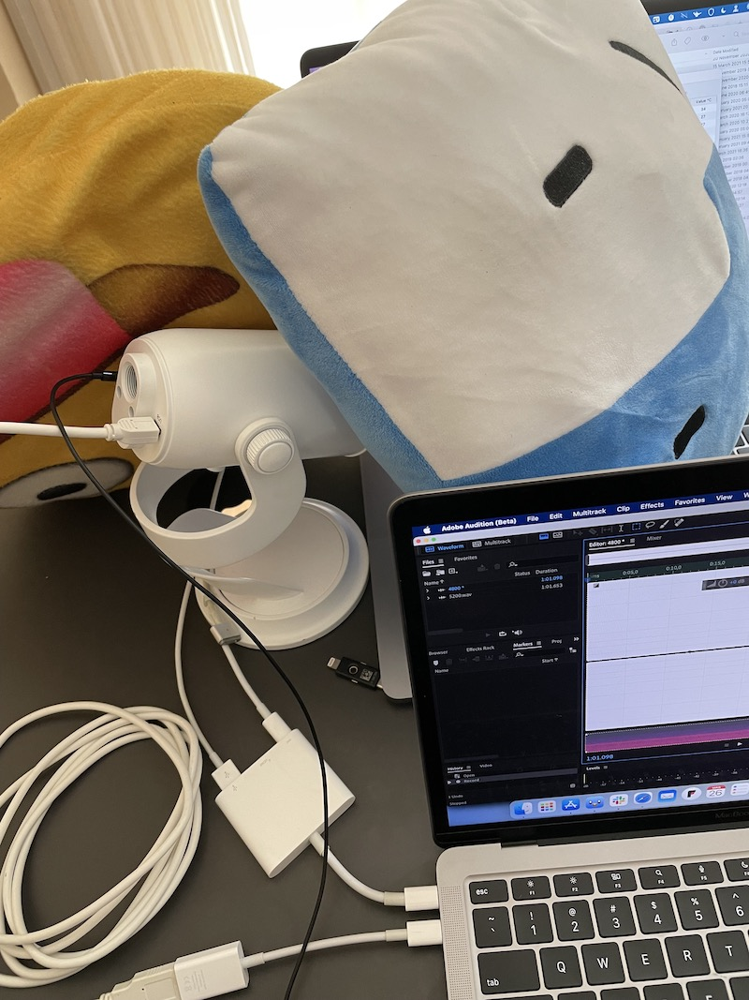

# FanFan

## If you're a fan of fans, this app is for you!

With its state of the art Fan Simulation Engine (patent pending), FanFan can bring back that soothing sound of computer fans to your Apple Silicon Mac.

[You can download the app here (requires Apple Silicon Mac)](https://fanfan.rambo.codes)

# FAQ

### What is this app? lol

This app was made as an April Fools' joke for 2021, but it actually works! It will observe the system's CPU usage and change the pitch and volume of the fan noise when it goes up. The CPU usage observed is a moving average of all CPU cores, which more closely emulates what a real fan does. I thought about using temperature as the input, but Apple Silicon Macs don't get hot that easily, so the joke wouldn't work as well.

### How good is the code?

Not that good. Since this is a joke, I set myself a really hard limit of 2h to get it done, hence the code quality is not extremely high.

### Why does it require an Apple Silicon Mac?

Because it's more funny that way 😆 Feel free to remove all the `#if arch(x86_64)` and run it on your Intel Mac, it does work.

### How did you capture the Fan noise?

I used my 2019 MacBook Pro and a fan control app to crank the RMP up to 4800, then recorded it using a Blue Yeti microphone.

